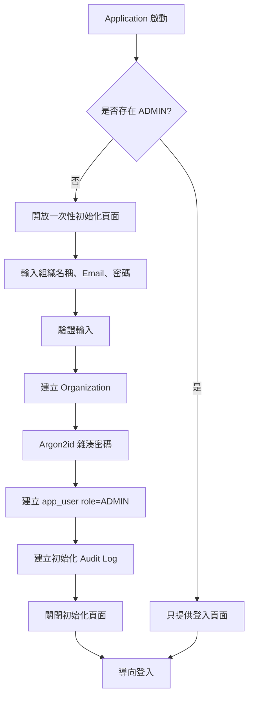
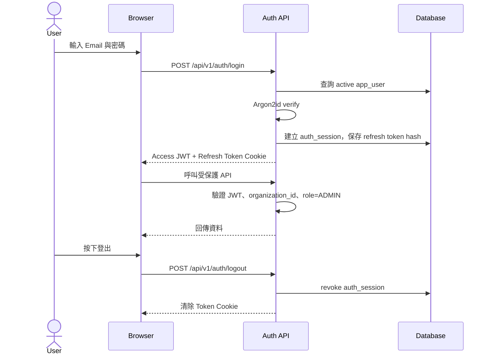
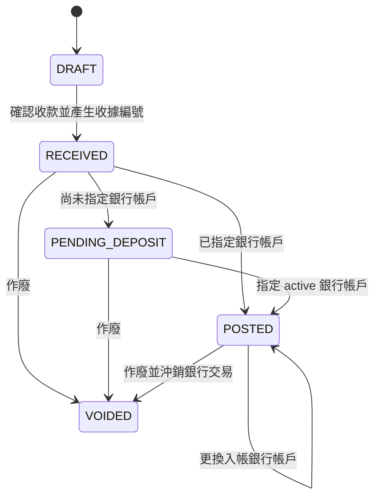
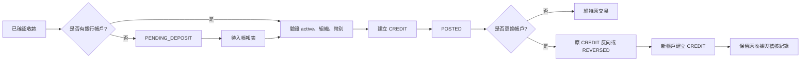
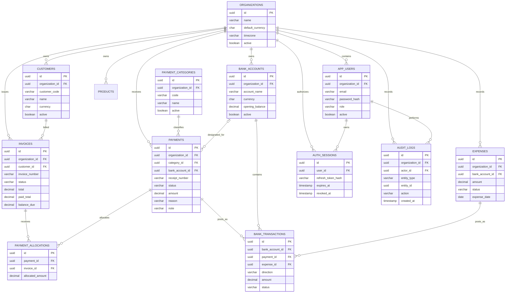

# 財務系統探索報告

> 探索日期：2026-08-23  
> 報告範圍：Invoice Ninja 核心功能重製、收款與收據、銀行帳務、ERP 報表，以及登入與系統初始化。  
> 文件性質：需求探索與設計整理，不代表已完成程式實作。

## 1. 執行摘要

本專案預計建立一套以 Spring Boot 為後端的輕量財務與 ERP 系統，核心業務鏈如下：

```text
客戶/產品
    -> 報價單
    -> 發票
    -> 收款
    -> 銀行入帳
    -> ERP 報表
```

本次探索已形成以下方向：

- 收款與銀行入帳分離，收款可以先處於待入帳狀態。
- 銀行帳戶支援 `CREDIT` 與 `DEBIT`，產品語意為入帳增加、出帳減少。
- 每筆確認收款必須有一個分類，並可輸入事由與選填備註。
- 事由與備註的 Autocomplete 建議值來自資料庫，使用者仍可修改或自行輸入。
- 確認收款時產生唯一收據編號，重印時沿用原編號。
- 一張 A4 直式紙張列印三聯收據，三聯共用同一收據編號。
- 密碼使用 Argon2id，登入使用 JWT，並支援登出。
- 角色先維持最輕量設計，目前只使用 `ADMIN`。

## 2. 已確認的技術與業務決策

### 2.1 技術方向

| 項目 | 已確認內容 |
|---|---|
| 後端 | Spring Boot、Spring MVC |
| 分層 | `Controller -> Service -> Repository` |
| API | MVC Controller 與 Web API Controller 分離 |
| API 資料 | 優先使用 DTO，不直接暴露 Entity |
| 前端 | Vue 3 JavaScript、Bootstrap 5.3、Axios、SweetAlert2 |
| 執行環境 | 離線架構，不使用 CDN |
| UI | 古典、穩重、易讀，支援 RWD 與鍵盤操作 |
| 密碼 | Argon2id 雜湊 |
| JWT 設定 | `security.jwt.secret=${JWT_SECRET}` |
| 登入狀態 | JWT |
| 登出 | 必須提供登出機制 |
| 角色 | 目前只需要 `ADMIN` |

### 2.2 財務功能

| 領域 | 探索結果 |
|---|---|
| 客戶 | 維護客戶基本資料與組織歸屬 |
| 產品/服務 | 維護品項、單價、幣別與稅務設定 |
| 報價單 | 支援草稿、送出、接受、拒絕、過期與取消 |
| 發票 | 具備組織內唯一發票編號、明細、稅額、付款總額與應收餘額 |
| 收款分類 | 每筆確認收款必須有且只有一個分類，例如罰款、報名費、保證金、手續費 |
| 收款事由 | 可輸入、選取建議、修改，並保存最後確認文字 |
| 收款備註 | 選填；空白時可不列印備註欄 |
| 待入帳 | 收款完成時可以不指定銀行帳戶，列入待入帳報表 |
| 銀行帳務 | 支援多個銀行帳戶與 Credit/Debit 交易 |
| 收據 | 確認時產生唯一且不可重用的收據編號 |
| 列印 | 一張 A4 直式紙張列印三聯，三聯資料一致 |
| 報表 | 支援待入帳、收款分類、銀行餘額、應收帳款、費用、稅務與收支摘要 |

## 3. 身份驗證與 ADMIN 初始化

### 3.1 輕量角色模型

目前不建立複雜 RBAC。所有可登入使用者先使用同一個角色：

```text
User.role = ADMIN
```

這個版本的 `ADMIN` 可執行目前規劃的 ERP 操作，包括客戶、產品、發票、收款、銀行帳務、報表與使用者初始化。未來若需要多人分權，再新增 `OPERATOR`、`VIEWER` 或權限表，不在目前階段預先增加複雜模型。

### 3.2 首次初始化流程



初始化時應在同一個 Service transaction 中建立組織與第一位 `ADMIN`，並透過唯一約束或資料庫鎖避免兩個請求同時建立初始管理員。

初始化規則：

1. 不在 migration 或原始碼中寫死預設密碼。
2. 密碼只保存雜湊結果，不保存明文。
3. 初始化完成後，公開初始化頁面必須關閉。
4. 初始管理員建立時留下稽核紀錄。
5. 不允許移除組織最後一位管理員。
6. 後續使用者註冊/邀請政策尚未最後確認；輕量版本可先限制只有初始 `ADMIN` 能管理使用者。

### 3.3 Argon2id 設定

JWT 設定保持為：

```properties
security.jwt.secret=${JWT_SECRET}
```

Argon2id 參數可暫時放在 `application.properties`：

```properties
security.password.argon2.salt-length=16
security.password.argon2.hash-length=32
security.password.argon2.parallelism=1
security.password.argon2.memory-cost=65536
security.password.argon2.iterations=3
```

參數應在實際部署硬體上進行 benchmark，再決定正式值。JWT secret 應由作業系統環境變數 `JWT_SECRET` 注入，不應寫入專案、文件、Git、前端程式碼或 log。已在對話中出現過的密鑰應視為不可再使用並進行輪替。

### 3.4 JWT 與登出

建議採短效 Access JWT 加上可撤銷的 Refresh Session：



建議行為：

- Access JWT 使用短期限，例如 15 分鐘。
- Refresh Token 使用 `HttpOnly`、`Secure`、`SameSite` Cookie。
- 資料庫只保存 Refresh Token 的雜湊值。
- JWT payload 只放 user id、organization id、role、session id、token id 與過期時間等必要資訊。
- 登出時撤銷 `auth_session` 並清除 Cookie，不得再使用該 Refresh Token 換發 Access JWT。
- Access JWT 在剩餘期限內可能仍然有效；若要求登出後立即失效，需增加 token denylist 或每次以 session 狀態即時檢查。

## 4. 收款與銀行入帳模型

### 4.1 收款狀態

收款本身與銀行入帳是兩個不同事件：



### 4.2 銀行 Credit/Debit 語意

本產品先使用現金流語意，而不是完整複式簿記語意：

```text
CREDIT = 入帳，銀行帳戶餘額增加
DEBIT  = 出帳，銀行帳戶餘額減少

Balance = opening_balance + Credit total - Debit total
```

主要來源：

- 收款入帳：建立 `CREDIT`。
- 費用出帳：建立 `DEBIT`。
- 帳戶轉帳：來源帳戶建立 `DEBIT`，目的帳戶建立 `CREDIT`。
- 更正交易：保留原交易，新增反向交易或標記 `REVERSED`，不可直接刪除。

### 4.3 待入帳與改帳戶流程



指定或更換帳戶必須由 Service transaction 完成，Controller 不可直接修改 `bank_account_id`。更換帳戶不得改變收款金額、分類、事由、備註、收款日期或收據編號。

## 5. 核心資料關聯

下圖是探索階段的邏輯模型，實際資料庫型別與 migration 語法可在 implementation phase 再決定：



`AUTH_SESSIONS` 是為了支援 JWT 登出而新增的設計。JWT 本身是無狀態的，若要撤銷 Refresh Token，就必須保存 session 的撤銷狀態。所有財務資料仍以 `organization_id` 作為租戶隔離條件。

## 6. Autocomplete 與收據

### 6.1 Autocomplete

事由與備註建議值由資料庫提供，使用者輸入的最終文字則保存於收款資料本身：

```text
Database suggestions
        |
        v
ReceiptTextSuggestionService
        |
        +--> Spring Cache
        |
        v
Vue autocomplete field
        |
        v
Payment.reason / Payment.note
```

建議規則：

- 建議資料依 `organization_id` 隔離。
- 欄位類型區分 `REASON` 與 `NOTE`。
- 搜尋條件至少包含組織、欄位類型、啟用狀態與關鍵字。
- 使用者選取後仍可修改文字。
- 自訂文字可直接保存，不必強制建立新的建議資料。
- 建議值新增、修改、停用後清除相關 Cache。
- 單機先使用 Spring Cache + Caffeine；多節點時可改用 Redis。

### 6.2 唯一編號與三聯收據

收款確認流程：

1. 驗證金額、分類、收款日期、付款方式與必要欄位。
2. 鎖定組織/年度的收據序列。
3. 產生唯一 `receipt_number`。
4. 保存付款與收據編號。
5. 若尚未指定銀行帳戶，狀態為 `PENDING_DEPOSIT`。

收據編號即使收款作廢也不可回收。重印只建立列印紀錄，不建立第二筆收款或第二個編號。

```text
A4 portrait
+-------------------------------+
| 存根聯                        |
| Receipt No: RC-YYYY-XXXXXX    |
+-------------------------------+
| 客戶收據                      |
| Receipt No: RC-YYYY-XXXXXX    |
+-------------------------------+
| 會計聯                        |
| Receipt No: RC-YYYY-XXXXXX    |
+-------------------------------+
```

三聯只允許聯別標籤不同，分類、事由、備註、金額、幣別、付款方式與銀行帳戶資訊必須一致。列印模板需要固定 A4 portrait 尺寸與每聯高度，避免備註過長造成跨頁。

## 7. ERP 報表範圍

| 報表 | 主要內容 | 日期基準 |
|---|---|---|
| 待入帳報表 | 收據編號、付款人、分類、事由、備註、金額、幣別、付款方式 | `received_at` |
| 收款分類報表 | 各分類筆數與金額，可依客戶/期間/幣別篩選 | `received_at` |
| 銀行餘額報表 | 期初餘額、Credit、Debit、淨變動、期末餘額與明細 | `transaction_date` |
| 發票狀態報表 | 草稿、已發出、部分付款、已付款、逾期、取消 | `issue_date` / `due_date` |
| 應收帳款帳齡 | 未到期、1-30、31-60、61 天以上 | `due_date` |
| 費用報表 | 費用分類、對象、金額、付款帳戶與狀態 | `expense_date` |
| 稅務報表 | 稅率、稅額與期間統計 | 文件日期 |
| ERP 收支摘要 | 已入帳收款 Credit、費用 Debit、淨額 | 可選收款/交易/費用日期 |

報表共同能力：

- 組織、期間、客戶、收款分類、銀行帳戶、幣別與狀態篩選。
- 分頁、排序、空資料狀態與查詢錯誤狀態。
- 匯出表格時保留篩選條件、日期基準、幣別、總計與產生時間。
- 每一列可追溯至來源發票、收款、費用或銀行交易。
- 排除取消、作廢與沖銷資料，避免重複計算。

## 8. 系統邊界

### 本階段包含

- Invoice Ninja 核心的客戶、產品、報價單、發票與收款流程。
- 單一組織隔離模型。
- 單一 `ADMIN` 角色。
- Argon2id 密碼驗證、JWT 登入與登出。
- 收款分類、事由、選填備註、Autocomplete、唯一收據與 A4 三聯。
- 多銀行帳戶、Credit/Debit、待入帳與入帳帳戶異動。
- 基礎 ERP 報表與表格匯出。

### 本階段不包含

- 外部銀行或第三方支付 API 串接。
- 完整複式簿記、總帳、會計科目與財務結算。
- 多角色權限矩陣。
- 多組織切換與跨幣別匯兌。
- MFA、社群登入與第三方身份提供者。
- 自動銀行對帳。

## 9. 尚待確認事項

以下事項仍會影響後續規格，實作前需要定案：

1. 後續使用者加入方式：只允許 `ADMIN` 建立使用者、邀請制，或暫時完全不開放新增使用者。
2. JWT 儲存方式：HttpOnly Cookie 或 `Authorization: Bearer`；瀏覽器 ERP 建議使用 HttpOnly Cookie。
3. Access/Refresh Token 期限；目前 15 分鐘/7 天只是建議值。
4. 登出即時失效程度：只撤銷 Refresh Session，或連尚未過期的 Access JWT 也立即失效。
5. 初始化入口：第一次啟動的一次性 Web 初始化頁面，或由部署指令建立第一位 `ADMIN`。
6. 密碼政策：最低長度、複雜度、登入失敗鎖定與密碼重設流程。
7. 收款與發票關係：MVP 是否限制一筆收款只能分配一張發票。
8. 報表匯出格式：先支援 CSV，或同時需要 XLSX/PDF。
9. 資料庫產品：PostgreSQL、MySQL 或 Microsoft SQL Server。

## 10. 建議下一步

1. 確認身份驗證的未決事項，優先決定初始化入口、使用者加入方式與 JWT 儲存方式。
2. 建立身份驗證與 ADMIN 初始化的 OpenSpec change，將已確認決策寫入 proposal、spec、design 與 tasks。
3. 把 `AUTH_SESSIONS`、Argon2id 設定、JWT 撤銷與登出流程加入資料庫 Schema 與 API 契約。
4. 完成登入、初始化、登出與組織隔離的整合測試後，再進入發票、收款與銀行帳務實作。
5. 最後以瀏覽器桌面/手機尺寸驗證 ERP 表單、報表、三聯收據列印與離線資源。
